# 🌍 Travel & Events Intelligence Agent – Multi-Agent GenAI System

## 🎯 Project Objective

Build an intelligent multi-agent system that assists users in planning trips by gathering personalized travel data and summarizing it into a tailored itinerary with a strategy recommendation.

**User Inputs**:
- Destination City
- Month of Travel
- Event Interests (e.g., concerts, sports)
- Hotel Preferences (e.g., luxury, boutique)
- Travel Preferences (e.g., baggage, cabin class, stops)

**System Outputs**:
1. ✅ Curated event list
2. ✅ Top hotel recommendations
3. ✅ Best flight options
4. ✅ Weather and congestion insights
5. ✅ Day-by-day itinerary and strategic recommendation

## 🧠 Agent-Based System Flow

The system follows a modular, agentic approach where each agent is responsible for a domain-specific task. Agents operate asynchronously and communicate their output downstream into a final summarization agent.

```
[1] Event Discovery Agent
        ↓
[2] Flight Pricing Agent
        ↓
[3] Weather Insights Agent
        ↓
[4] Hotel Finder Agent
        ↓
[5] Web Search Agent (optional)
        ↓
[6] Strategic Travel Recommender (GPT-4o)
```

## 🤖 Agent Tasks & Tools

### 1. 📅 Event Discovery Agent

**Purpose**: Retrieve relevant events at the destination based on interest categories.

**Inputs**:
- City
- Travel Month
- Event Preferences (e.g., Music, Sports)

**Actions**:
- Call external APIs to fetch events metadata
- Normalize results and remove duplicates

**APIs Used**:
- `Ticketmaster Discovery API`
- `PredictHQ Events API`

**Outputs**:
- Event title
- Date
- Popularity
- Event type
- URL
- Venue name

### 2. ✈️ Flight Pricing Agent

**Purpose**: Identify the best-value flight options based on preferences and filters.

**Inputs**:
- Origin airport (detected or user-supplied)
- Destination
- Travel Month
- Bags
- Cabin Class
- Max Stops

**Actions**:
- Fetch flight data from RapidAPI (Google Flights)
- Optimize for price, duration, and flexibility

**APIs Used**:
- `Google Flights API via RapidAPI`

**Outputs**:
- Airline name
- Price
- Stops
- Duration
- Booking link

### 3. 🌤️ Weather Insights Agent

**Purpose**: Provide weather expectations for trip planning and flag potential disruptions.

**Inputs**:
- Destination
- Travel Month

**Actions**:
- Pull average weather stats and forecasts
- Flag potential hazards (storms, heavy rain, extreme cold/heat)

**API Used**:
- `Open-Meteo Forecast API`

**Outputs**:
- Avg. temperature
- Rainfall prediction
- Alerts or disruptions

### 4. 🏨 Hotel Finder Agent

**Purpose**: Suggest the top 2–3 hotels based on style and availability.

**Inputs**:
- City
- Travel Month
- Hotel Style (Luxury, Boutique, Budget)

**Actions**:
- Fetch hotels and filter by rating, price, and amenities
- Currently pending API selection

**Hotel API Options** *(TBD)*:
- Amadeus Hotel Offers API
- Hotellook API via RapidAPI
- Booking.com or Expedia API

**Outputs**:
- Hotel name
- Price/night
- Star rating
- Amenities
- Booking link

### 5. 🔍 Web Search Agent (Optional)

**Purpose**: Supplement information with real-time news, blog posts, or ticket availability.

**Inputs**:
- Top events
- Hotels
- Flight alerts or delays

**Actions**:
- Perform semantic and keyword search
- Retrieve summaries or links for user reference

**APIs Used**:
- `DuckDuckGo`
- `Tavily`
- `SerpAPI`

**Outputs**:
- Article headlines
- URLs
- Snippets/summaries

### 6. 🧠 Strategic Travel Recommender Agent

**Purpose**: Aggregate all outputs and generate a Markdown itinerary and business strategy recommendation.

**Inputs**:
- All prior agent outputs: Events, Flights, Hotels, Weather, and Web Results

**Actions**:
- Use GPT-4o to summarize and reason about demand
- Suggest action: Promote / Avoid / Upsell

**LLM Tool**:
- `OpenAI GPT-4o (via OpenAI SDK)`

**Outputs**:
- Full trip plan in Markdown
- Strategic recommendation banner (e.g., “⚠️ Avoid: Storm forecasted”)

## 🧰 Tools & Technologies

| Layer         | Tool / API                            |
|---------------|----------------------------------------|
| LLM           | OpenAI GPT-4o (via OpenAI SDK)         |
| Orchestration | Async Python + custom agent functions  |
| Frontend      | Streamlit                              |
| API Clients   | HTTPX / Requests                       |
| Weather       | Open-Meteo API                         |
| Events        | Ticketmaster API, PredictHQ API        |
| Flights       | Google Flights via RapidAPI            |
| Web Search    | DuckDuckGo, Tavily, SerpAPI            |
| Hotels        | 🔍 *(To be selected)*                  |
| Caching       | Streamlit session_state, backoff       |


## 📡 Observability with Langfuse

Langfuse is integrated into the system for full observability of agent behavior, API usage, and LLM calls.

### ✅ What Langfuse Provides
- Logs each agent's inputs, outputs, and latency
- Tracks OpenAI GPT-4o token usage and cost
- Flags failed or retried agent runs
- Visualizes agent interaction flow in the Langfuse dashboard

### 🔧 Integration Details
- Every agent (Event, Flight, Hotel, etc.) is wrapped in a Langfuse span
- GPT-4o summarization and itinerary generation is tracked as a separate LLM call
- All traces are grouped under a unique trace per user session or query

### 📂 Example Trace Structure in Langfuse
- `Trace`: TravelAgentOrchestration
  - `Span`: EventDiscoveryAgent
  - `Span`: FlightsAndHotels (parallelized)
  - `Span`: WeatherAndCongestion
  - `Span`: GPT4o_Summarization

### 🔐 Setup
In your `.env` file, add:
```env
LANGFUSE_PUBLIC_KEY=your_key
LANGFUSE_SECRET_KEY=your_secret
LANGFUSE_HOST=https://cloud.langfuse.com
```

### 📊 Benefits
- Understand agent execution time and failures
- Monitor cost and token consumption from GPT-4o
- Enable analytics and observability for real users and test runs


## 🚀 Sample User Flow (Streamlit App)

1. **User Input:**
   - City = "Tokyo"
   - Month = "April"
   - Hotel Style = "Luxury"
   - Events = "Music, Sports"
   - Bags = 1, Class = Economy

2. **System Execution:**
   - Agents fetch Events → Weather → Hotels → Flights
   - GPT-4o generates Markdown itinerary

3. **Output Dashboard:**
   - 🎉 Events + 🏨 Hotels + ✈️ Flights
   - 📋 Downloadable Markdown itinerary
   - 📊 Strategy Score (e.g., Promote, Avoid)


## 🗺️ Agent Flow Diagram (Mermaid)

```mermaid
graph TD
    A[User Input: City, Month, Preferences] --> O[🧭 Orchestration Agent]

    O --> B[📅 Event Discovery Agent]
    O --> C[✈️ Flight Pricing Agent]
    O --> D[🌤️ Weather Insights Agent]
    O --> E[🏨 Hotel Finder Agent]
    O --> F[🔍 Web Search Agent - Optional]

    B --> G[🧠 Strategic Recommender Agent - GPT-4o]
    C --> G
    D --> G
    E --> G
    F --> G

    G --> H[📋 Markdown Itinerary and Strategy Suggestion]
```




## 📄 Sample Markdown Output

```markdown
# 🎌 Tokyo Trip - April 2025

## ✈️ Top Flights
- ANA – $823 – Direct – 13h – [Book Now](link)
- Air Canada – $749 – 1 Stop – 16h – [Book Now](link)

## 🏨 Hotels
1. The Okura – $220/night – 5⭐ – Spa, WiFi – [Link](link)
2. Shinjuku Granbell – $180/night – 4⭐ – Rooftop bar, Gym – [Link](link)

## 🎟️ Events
- Coldplay Tour – Apr 13 – Tokyo Dome – [Tickets](link)
- Tokyo Auto Salon – Apr 15 – Big Sight – [Tickets](link)

## 🌤️ Weather
- Avg: 18°C – Mostly Clear
- Light showers possible in evenings

## 🚨 Strategic Recommendation
**✅ High demand: Launch travel promo bundle for music fans**
```

## 📌 Next Steps

- ✅ Finalize the hotel provider API
- 🔐 Add API keys in `.env`
- 🔧 Implement async agents using OpenAI SDK
- 🧪 Mock test with sample data

## 👨‍💻 Contributors

- **Team Members**: Navjot, Zohreh, Leanne, Charaf, Jason J, Jason W, Stephaine
- **Design by**: OpenAI GPT-4o
- **Travel APIs**: Ticketmaster, PredictHQ, Open-Meteo, RapidAPI, Tavily, etc.
